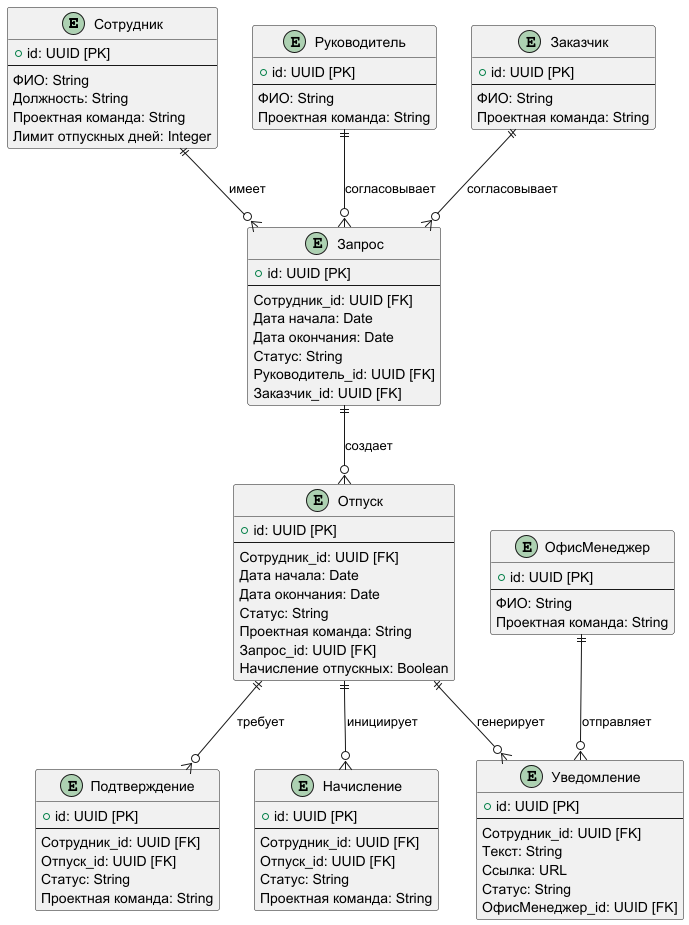

# HolyDays – приложение для автоматизации процесса планирования и согласования отпускных дней в компании

## Контекст

Компании fuse8/ByteMinds требуется автоматизация процесса планирования и согласования отпусков. Данная задача возникла в
связи с
тем, что текущий процесс согласования состоит из отправки писем по корпоративной почте, а средства планирования свои у
каждого сотрудника (календари, Google Docs):

1. Планирование отпуска
   Сотрудник планирует отпускные дни в своем календаре, в электронных таблицах, или в другом инструменте. Затем
   сотрудник пишет письмо на имя директора компании, технического директора, офис-менеджера, руководителя с просьбой о
   согласовании.
2. Согласование с руководителем
   Руководитель получает уведомление о запросе и проверяет:
   Наличие пересечений с проектами.
   Текущую загрузку команды.
   Производится согласование с заказчиком: запрос передается ему для рассмотрения.
3. Согласование с заказчиком
   Заказчик получает запрос и оценивает его влияние на проект. После анализа он либо подтверждает возможность отпуска,
   либо отклоняет запрос.
4. Уведомление участников
   После окончательного согласования:
	- Руководитель получает подтверждение от заказчика.
	- Участники процесса уведомляются о согласовании отпуска посредством e-mail.
5. Внесение отпуска в системы
   Офис-менеджер регистрирует отпуск в следующих системах:
	- Forecast — для учета доступности сотрудников.
	- Holidays (Google Doc) — для обновления корпоративного календаря.
	- 1С — для кадрового учета и расчета заработной платы.
6. Подтверждение отпуска сотрудником
   За неделю до начала отпуска офис-менеджер отправляет запрос сотруднику на подтверждение отпуска. Сотрудник должен
   подтвердить планы через внутреннюю
   систему.
7. Начисление отпускных
   За три дня до начала отпуска офис-менеджер производит начисление отпускных сотруднику.

### Доска Event Storming существующего бизнес-процесса

### Терминология (единый язык)

- fuse8 - компания (РФ), для которой разрабатывается приложение
- ByteMinds - компания (Черногория), для которой разрабатывается приложение
- Сотрудник – работник компании, запрашивающий отпуск
- Проектная команда – группа сотрудников, работающих над одним проектом заказчика (в режиме аутстафф)
- Руководитель – менеджер компании, отвечающий за деловую коммуникацию проектной команды с менеджерами проекта со
  стороны заказчика
- Заказчик – менеджер проекта от компании-клиента, для которой работает проектная команда
- Офис-менеджер – работник компании, отвечающий за установку и проверку лимита отпускных дней сотрудника
- Forecast – система учета времени работы на проектах
- Harvest – система отслеживания задач
- Holidays – Google-doc для отображения отпускных дней сотрудников
- Запрос - запрос на отпуск, созданный сотрудником

## Бизнес-требования

- Снизить число ошибок и конфликтов при планировании и согласовании отпусков
- Объединить инструменты планирования и установки отпускных дней (Harvest) в одном месте
- Своевременно предоставлять данные об отпускных днях в органы управления

## Источники требований

1. К функциям:
	1. Бизнес-процесс планирования, согласования и установки отпускных дней в компании fuse8/ByteMinds, полученный в
	   результате
	   сессии Customer Development и Event Storming
	2. Стейкхолдеры: сотрудник (ведущий разработчик), руководитель (менеджер проекта), офис-менеджер
	3. Существующие инструменты планирования и учета времени работы
		1. Используемые в компании: Harvest, Forecast, Google-doc Holidays
		2. Рассмотренные решения: Timetastic, Timetta Timesheets
	4. Относительно компании fuse8 (РФ)
		1. ТК РФ Статья 122. Порядок предоставления ежегодных оплачиваемых отпусков
		2. ТК РФ Статья 123. Очередность предоставления ежегодных оплачиваемых отпусков
		3. ТК РФ Статья 124. Продление или перенесение ежегодного оплачиваемого отпуска
		4. ТК РФ Статья 125. Разделение ежегодного оплачиваемого отпуска на части. Отзыв из отпуска
		5. ТК РФ Статья 126. Замена ежегодного оплачиваемого отпуска денежной компенсацией
		6. ТК РФ Статья 128. Отпуск без сохранения заработной платы
		7. Политика конфиденциальности компании fuse8
	5. Относительно компании ByteMinds (Черногория)
		1. Закон Черногории "О труде" от 01.01.2019 (ZAKON O RADU)
		2. Внутреннее положение об условиях, продолжительности и порядке использования ежегодного отпуска (Interno
		   pravilo o uslovima, dužini trajanja i načinu korišćenja godišnjeg odmora)
		3. Политика конфиденциальности компании ByteMinds
2. К данным:
	1. Бизнес-процесс планирования, согласования и установки отпускных дней в компании fuse8
	2. Интегрируемые инструменты компании: Harvest, Forecast, Google-doc Holidays
	3. Относительно компании fuse8 (РФ)
		1. Постановление Госкомстата РФ от 05.01.2004 N 1 "Об утверждении унифицированных форм первичной учетной
		   документации по учету труда и его оплаты"
		2. Федеральный закон "О персональных данных" от 27.07.2006 N 152-ФЗ
	4. Относительно компании ByteMinds (Черногория)
		1. Закон о защите персональных данных Черногории (Zakon o zaštiti podataka o ličnosti)
		2. Закон о информационных услугах Черногории (Zakon o elektronskim komunikacijama)
3. К интерфейсам (API):
	1. Harvest API
	2. Forecast API

### Используемые в настоящее время инструменты планирования и согласования отпускных дней:

- Harvest – система учета времени работы на проектах, поддерживает установку отпускных дней сотрудников
- Forecast – система учета времени работы на проектах, позволяет отображать отпускные дни сотрудников на диаграмме Ганта
- Google-doc Holidays – Google-документ компании fuse8/ByteMinds, в котором отображаются отпускные дни сотрудников
- Timetastic – enterprise-решение для планирования отпусков
- Timetta Timesheets – система учета времени работы на проектах с собственной эко-системой ведения проектов, позволяет
  координировать отпускные дни сотрудников

Критерии сравнения:

- Поддержка рабочего календаря РФ
- Поддержка рабочего календаря Черногории
- Локализация на русский язык
- Локализация на английский язык
- Наличие уведомлений
- Поддержка экспорта данных
- Анализ пересечения отпусков в команде
- Наличие API
- Цена

## Цель

Сократить объем ручной работы по планированию и согласованию отпускных дней на 50% после запуска MVP

## Пользовательские требования

- Снизить число ошибок и конфликтов при планировании и согласовании отпускных дней
	1. Офис-менеджер:
		- Автоматически запрашивать подтверждение отпускных дней за неделю до его начала
		- Иметь напоминание о необходимости в выплате отпускных дней
	2. Руководитель:
		- Оперативнее согласовывать отпускные дни команды с заказчиком
	3. Сотрудник:
		- Иметь инструмент планирования отпускных дней с учетом отпусков команды
		- Иметь инструмент для возможности отправки запроса переноса отпускных дней на следующий год
- Объединить инструменты планирования и установки отпускных дней (Harvest) в одном месте
	1. Офис-менеджер:
		- Автоматически устанавливать отпускные дни в учетных системах
	2. Руководитель:
		- Получать актуальную и подтвержденную информацию о запрошенных отпускных днях проектной команды
	3. Сотрудник:
		- Автоматически получать информацию об обновлении статусов согласования отпускных дней
- Своевременно предоставлять данные об отпускных днях в органы управления
	1. Офис-менеджер:
		- Получать информацию об отпускных днях сотрудников без постоянных уведомлений
	2. Руководитель:
		- Отсылать актуальную информацию об отпусках команды заказчику
	3. Заказчик:
		- Получать актуальную информацию об отпускных днях проектной команды

### Детализация требований

- Планирование дат отпуска сотрудником
	- Выбор дат на календаре
	- Анализ пересечения дат отпуска с командой
	- На стадии планирования создается черновик до отправки на согласование
	- Отображение выходных, праздничных и сокращенных дней
- Стадии согласования отпуска
	- Отправлен
	- Прочитан
	- На согласовании
	- Разрешен
	- Отклонен + причина
- Типы отпуска
	- Ежегодный оплачиваемый отпуск
	- Больничный
	- Отпуск без содержания
	- Отпуск по беременности
	- Отпуск по уходу за ребенком
	- Академический отпуск
- Редактирование дат отпуска сотрудником
	- В черновике
	- На стадии `отправлен`
	- На стадии `прочитан` + уведомление согласующих, перевод на стадию `отправлен`
	- На стадии `согласования` + уведомление согласующих, перевод на стадию `отправлен`
- Установка и проверка лимита отпускных дней сотрудника
- Отображение отпускных дней руководителям
	- Классический вертикальный вид (Google-документ Holidays)
	- Диаграмма Ганта (Forecast Projects)
	- Фильтрация по конкретным сотрудникам
	- Фильтрация по проектным командам
- Отображение отпускных дней заказчикам
- Уведомление офис-менеджера о подтверждении отпуска сотрудником и необходимости в выплате отпускных

## Моделирование

### Прецеденты

### Предметная область

На основе Event Storming можно выделить:

События:

1. Отпуск спланирован: сотрудник, даты
2. Запрос на согласование отпуска отправлен руководителю: запрос, руководитель
3. Запрос на согласование отпуска отправлен заказчику: запрос, заказчик
4. Запрос удовлетворен: запрос
5. Руководитель уведомлен о согласовании отпуска: руководитель, запрос
6. Сотрудник уведомлен о согласовании отпуска: сотрудник, запрос
7. Офис-менеджер уведомлен о согласовании отпуска: офис-менеджер, запрос
8. Отпуск отмечен в Harvest: отпуск
9. Отпуск отмечен в Forecast: отпуск
10. Отпуск отмечен в 1С: отпуск
11. Сотрудник уведомлен о необходимости в подтверждении отпуска: сотрудник, отпуск
12. Отпуск подтвержден сотрудником: отпуск
13. Отпускные начислены: отпуск

Команды:

1. Спланировать отпуск
2. Отправить запрос руководителю
3. Отправить запрос заказчику
4. Рассмотреть запрос
5. Ответить руководителю
6. Уведомить работника
7. Уведомить офис-менеджера
8. Отметить отпуск в Forecast
9. Отметить отпуск в Holidays
10. Отметить отпуск в 1С
11. Просьба подтвердить отпуск
12. Подтверждает отпуск
13. Подтвердить начисление отпускных

Агрегаты и сущности:

1. Контекст планирования
	- Сотрудник
		1. ФИО
		2. Должность
		3. Проектная команда
		4. Отпускные дни
		5. Запросы на отпуск
		6. Лимит отпускных дней
2. Контекст согласования
	- Запрос
		1. Сотрудник
		2. Даты
		3. Статус
		4. Руководитель
		5. Заказчик
	- Руководитель
		1. ФИО
		2. Проектная команда
		3. Запросы на отпуск
	- Заказчик
		1. ФИО
		2. Проектная команда
		3. Запросы на отпуск
3. Контекст учета
	- Отпуск
		1. Сотрудник
		2. Даты
		3. Статус
		4. Проектная команда
		5. Запрос
		6. Начисление отпускных
4. Контекст уведомлений
	- Уведомление
		1. Сотрудник
		2. Текст
		3. Ссылка
		4. Статус
	- Офис-менеджер
		1. ФИО
		2. Проектная команда
		3. Уведомления
	- Руководитель
		1. ФИО
		2. Проектная команда
		3. Уведомления
	- Заказчик
		1. ФИО
		2. Проектная команда
		3. Уведомления
5. Контекст подтверждения
	- Подтверждение
		1. Сотрудник
		2. Отпуск
		3. Статус
		4. Проектная команда
6. Контекст начисления
	- Начисление
		1. Сотрудник
		2. Отпуск
		3. Статус
		4. Проектная команда

### Модели данных
## На уровне приложения
Диаграмма предметной области

## На уровне хранения
Схема базы данных: реляционная
